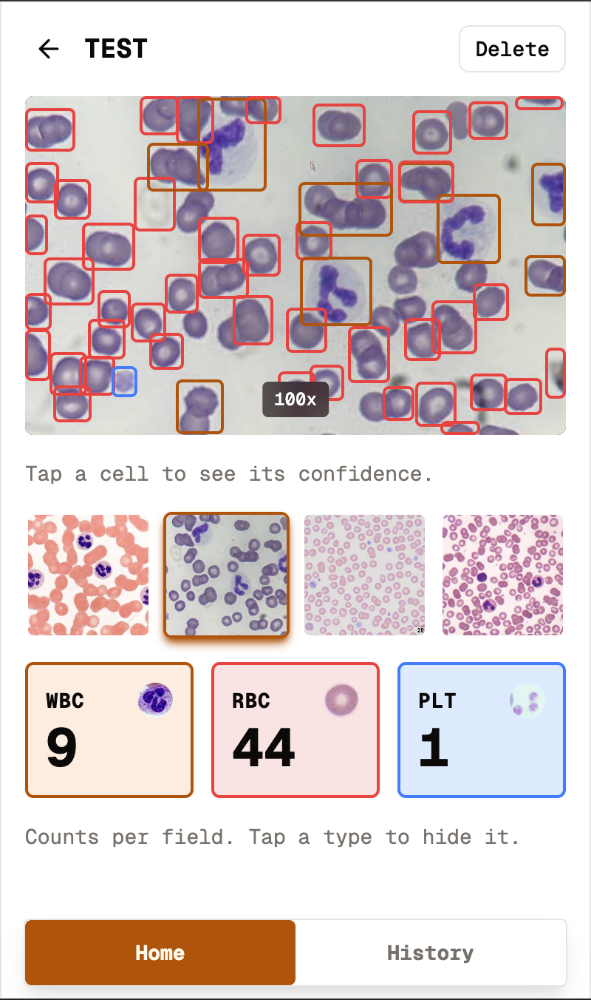

# MiloDetects

An assistive tool for blood smear analysis. Photograph a microscope field and
MiloDetects detects and localizes the cells in it: white blood cells, red blood
cells, and platelets; drawing labeled bounding boxes and reporting counts per field.

> MiloDetects detects and localizes cells.
> It does not perform a clinical differential or produce diagnostic values.
> See [Scope & limitations](#scope--limitations).

<!-- Demo video is a GitHub attachment URL (user-attachments/assets/…); re-upload the
     file via the README editor if the link ever breaks — raw repo URLs won't embed. -->

<table>
  <tr>
    <td align="center" valign="top" width="50%">
      <video src="https://github.com/user-attachments/assets/90e10c9d-fa9c-4607-9b8c-1b58fddcdce0" controls muted width="300"></video>
      <br /><sub><b>Capture → analyze</b></sub>
    </td>
    <td align="center" valign="top" width="50%">
      
      <br /><sub><b>Detection screen</b></sub>
    </td>
  </tr>
</table>

**Live demo:** https://milodetects-frontend.vercel.app/
**Backend repo:** https://github.com/julio22b/milodetects-backend

---

## Why this exists

A peripheral blood smear is read under a microscope to assess cell morphology and
composition. MiloDetects assists that step: it finds and labels cells in a photographed field and reports the counts, leaving interpretation to the person.

I built it because I'm a clinical bioanalyst by training. I've done this work before moving into software engineering.

---

## What it does

- Capture up to 10 microscope fields per session (phone camera or upload), tagged
  with a short sample id
- Detects and localizes WBCs, RBCs, and platelets in each field
- Draws labeled bounding boxes over the image; tap a detection for its confidence
- Reports counts per cell type, per field
- Persists every batch; a history view re-renders past results, boxes and all
- Mobile-first approach

---

## Architecture

```
React PWA  ──►  FastAPI backend  ──►  YOLOv8 (in-process)
                      │
                      ▼
                  Supabase  (Postgres + Storage)
```

This repo is the **frontend**, a React + TypeScript app handling capture, review, the
detection overlay, and history. It talks to the [FastAPI backend](https://github.com/julio22b/milodetects-backend), which runs the model and persistence.

### Details

**Boxes are stored as fractions, not pixels.** Each detection is saved as its center
and size relative to the image (0–1), the way YOLO outputs it. The same numbers then
render at any size: the full image, a downscaled thumbnail, or a past result reloaded
from history. The overlay never has to know the image's pixel dimensions.

**Built against a mock model.** The backend can return fake but realistic detections,
so I built and demoed the whole frontend — capture, overlay, counts, history — before
the real model was ready. Dropping in the trained model changed nothing on this side.

**One bad photo doesn't sink the batch.** Up to 10 images go up in a single request,
and each one passes or fails on its own. A failed image is a different type from a
successful one, so the code can't accidentally read detections off a photo that
never got any.

---

## The model

The backend runs YOLOv8n, fine-tuned on the
[BCCD blood cell dataset](https://huggingface.co/datasets/Francesco/bccd-ouzjz)
(255 training / 36 validation / 73 test images).

Test-set performance:

| Class       | mAP50     |
| ----------- | --------- |
| **Overall** | **0.919** |
| WBC         | 0.983     |
| RBC         | 0.892     |
| Platelets   | 0.881     |

---

## Scope & limitations

A few things this project deliberately doesn't do:

- **Detection and localization, not a differential.** The model finds and labels
  cells; it does not classify WBC subtypes. I might fine-tune the model later for this.
- **Not a concentration measurement, and not an analyzer replacement.** Counts are per
  photographed field, not calibrated concentrations.
- **Magnification sensitivity.** BCCD is captured at 100× oil immersion. Platelet
  detection degrades at lower magnification and may fail at 40×; a larger model could
  improve this later.
- **RBC double-counting in dense fields.** Clustered red cells are occasionally
  boxed twice; the detection IoU threshold is tunable to reduce this.
- **No authentication in v1.** Deliberately scoped out.

---

## Tech stack

**This repo:** React, TypeScript, Redux Toolkit
**Backend:** Python, FastAPI, Ultralytics YOLOv8, PyTorch (CPU)
**Data:** Supabase (PostgreSQL + Storage)

---

## Running locally

```bash
npm install
npm run dev
```

Point it at a running backend with an environment variable:

```
VITE_API_URL=http://127.0.0.1:8000
```

See the [backend repo](https://github.com/julio22b/milodetects-backend) for running the API. With the backend's
`INFERENCE_ENGINE=mock` (its default), the full app runs without any ML dependencies.

---

## Roadmap

- Test against images taken directly from a microscope
- Human-in-the-loop correction — let the reviewer confirm or reclassify each detection
  so the saved result reflects their judgment, not the model's
- Larger inference image size to improve small-object (platelet) recall
- Fine-tune on lower-magnification fields
